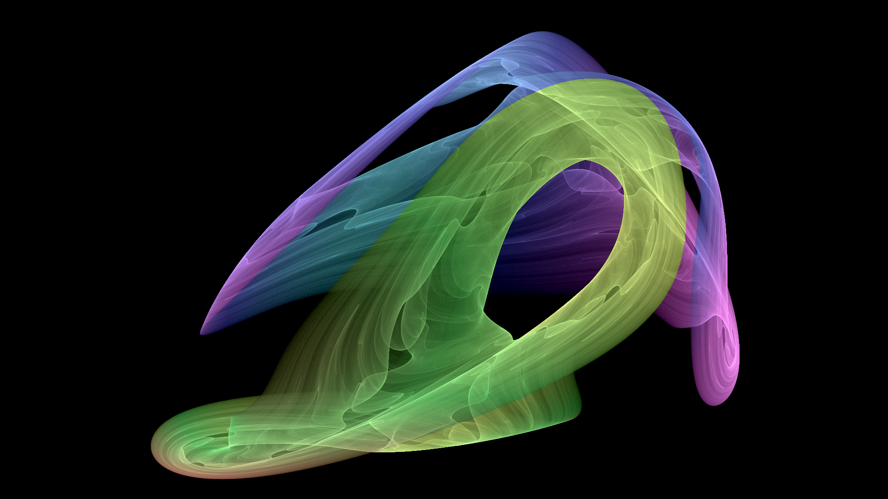

# Strange [attractor](https://en.wikipedia.org/wiki/Attractor) renderer

A library and CLI to generate strange attractors.



By default, this renders the poisson saturne attractor. This should be easy to change through coefficients (when using this as a library), and possibly in the binary (if I add the feature).
This can however only render a subset of attractors, those of the polynomial Sprott type (see this page from [chaoscope](http://www.chaoscope.org/doc/attractors.htm)). Adding more should be relatively easy.

## Features

All of these are optional.

-   PNG & BMP export
-   16-bit
-   transparency
-   render depth texture
-   CLI
-   multithreaded
-   brightness control
-   [shell completion](#shell-completion)

## Installation

You need to have the latest version of stable [Rust](https://rust-lang.org/) installed on your system.
Clone this repo. Run `cargo install --path . --profile production` to install the binary to your user's path.

## Shell completion

Using the subcommand `completion`, the binary automatically generates shell completions for your shell and tries to put them in the appropriate location.

When using Bash or Zsh, you should run the binary as root, as we need root privileges to write to their completion directories.
Alternatively, use the `--print` option to yourself write the completion file.

## Documentation

Documentation of the main branch can be found at [doc.icelk.dev](https://doc.icelk.dev/strange-attractor-renderer/strange_attractor_renderer/).

To document with information on which cargo features enables the code,
set the environment variable `RUSTDOCFLAGS` to `--cfg docsrs`
(e.g. in Fish `set -x RUSTDOCFLAGS "--cfg docsrs"`)
and then run `cargo +nightly doc`.

## Performance

This should be the fastest possible both in multithreaded and single-threaded mode.
When running multithreaded, the main limiting factor is memory speed, not processing power (if you don't have a potato CPU, that is).

## Animations

Using the `sequence` subcommand, you can generate a series of images. Then use the following command to encode it into a H.264 video.
See it's `--help` flag for available options.

```shell
$ ffmpeg -i attractor%02d.png -vcodec libx264 -crf 17 -pix_fmt yuv420p out.mp4
```

You need to change the `%02d` part to the length of the frame index part of the outputted file name.

## Images

These are generated using the following commands:

```shell
# Build binary
$ cargo build --release

# poisson-saturne.png
$ target/release/strange-attractor-renderer -i1000000000 -b -0.25
# solar-sail.png
$ target/release/strange-attractor-renderer -i1000000000 -h2000 -w1800 -b -0.1 -p solar-sail
# solar-sail-220deg.png:
$ target/release/strange-attractor-renderer -i1000000000 -h2000 -w1800 -p solar-sail -a 220
```


## License

This library and binary artefacts are licensed under the [GNU LGPLv3](COPYING.LESSER).
